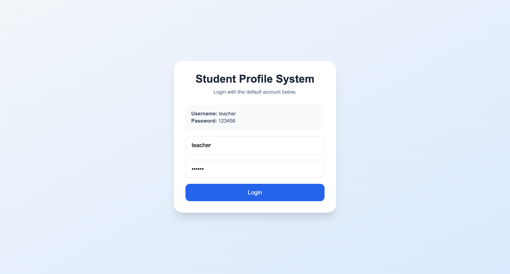
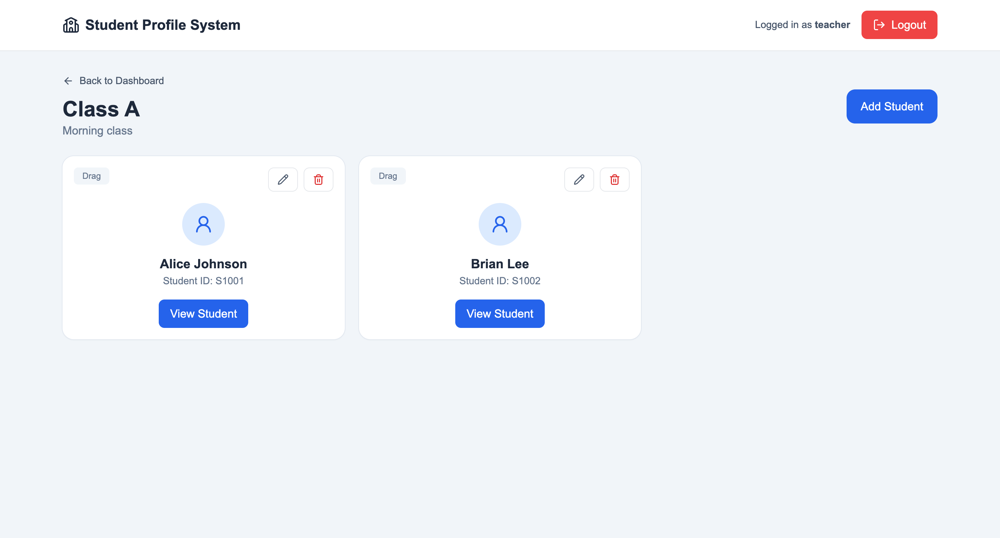

# Student Profile Management System

A **React + Vite web application** that allows teachers to manage classes and student profiles. The system supports class management, student records, grade tracking, notes, and skill visualization using a hexagon radar chart.

All data is stored locally in the browser using **localStorage**, so no backend server is required.

---

# Features

## Authentication

- Simple teacher login system
- Credentials stored in localStorage
- Protected routes to prevent unauthorized access

## Class Management

- Create new classes
- Edit class information
- Delete classes
- View students in each class

## Student Management

- Add students to a class
- Edit student information
- Delete students
- Upload and display student profile images
- Drag-and-drop to reorder students

## Student Profile Page

Each student has a dedicated page displaying:

- Student name
- Student ID
- Profile image
- Skill hexagon chart
- Grades
- Notes

## Grade Management

- Add grades
- Edit grades
- Delete grades

Fields include:

- Subject
- Date
- Type (Quiz / Test / Exam)
- Score

## Notes System

- Add notes
- Edit notes
- Delete notes

Used for teacher observations or feedback.

## Skill Visualization

Student performance is visualized using a **hexagon radar chart** with the following skills:

- Communication
- Teamwork
- Problem Solving
- Leadership
- Creativity
- Discipline

---

# Technologies Used

- React
- Vite
- Tailwind CSS
- React Router
- Recharts (Radar Chart)
- @hello-pangea/dnd (Drag and Drop)
- Lucide React Icons
- Browser localStorage

---

# Project Structure
```bash
src
│
├── components
│   ├── ClassCard.jsx
│   ├── StudentCard.jsx
│   ├── Navbar.jsx
│   ├── ProtectedRoute.jsx
│   ├── SkillRadarChart.jsx
│   ├── StudentFormModal.jsx
│   ├── GradeFormModal.jsx
│   └── NoteFormModal.jsx
│
├── pages
│   ├── LoginPage.jsx
│   ├── DashboardPage.jsx
│   ├── ClassPage.jsx
│   └── StudentDetailPage.jsx
│
├── context
│   ├── AuthContext.jsx
│   └── SchoolContext.jsx
│
├── utils
│   └── storage.js
│
├── App.jsx
├── main.jsx
└── index.css
```

# How Data is Stored

All data is stored in **browser localStorage**.

Keys used:
1. student_profile_users
2. student_profile_classes
3. student_profile_current_user


Example student structure:

```json
{
  "id": "student1",
  "name": "Alice",
  "studentId": "S1001",
  "image": "base64image",
  "skills": {
    "communication": 80,
    "teamwork": 75,
    "problemSolving": 85,
    "leadership": 70,
    "creativity": 78,
    "discipline": 90
  },
  "grades": [],
  "notes": []
}
```

# Installation

1. Clone the repository
```bash
git clone https://github.com/JarvisLam-LemonCEO/Student-Profile-System.git
```

2. Enter the project folder
```bash
cd student-profile-system
```

3. Install dependencies
```bash
npm install
```

4. Run development server
```bash
npm run dev
```

5. Open in browser

```bash
http://localhost:5173
```
6. Default Login
```json
Username: teacher
Password: 123456
```

# Screenshots





# Limitations

Because this project uses localStorage:
1. Data only exists on the current browser
2. Clearing browser storage removes all data
3. Passwords are not encrypted
4. Not suitable for production environments

This design is intended for learning and demonstration purposes.

# Future Improvements
Possible enhancements:
1. Backend API (Node.js + Express)
2. Database integration (MongoDB / PostgreSQL)
3. Secure authentication with hashed passwords
4. Multiple teacher accounts
5. Student search and filtering
6. Export/import class data
7. Dark mode support
8. Image compression

License
This project is for educational purposes.

