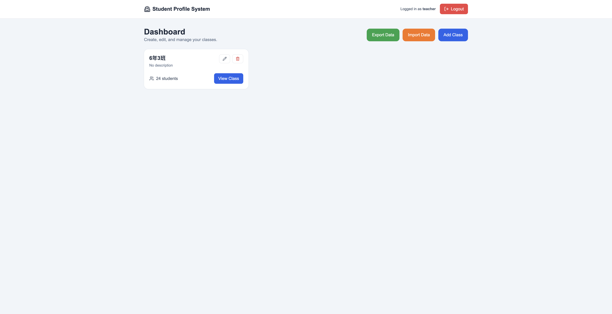
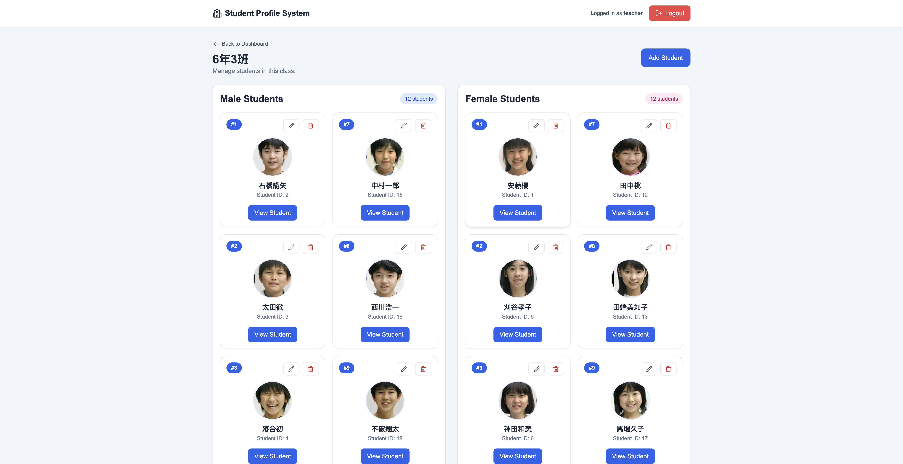
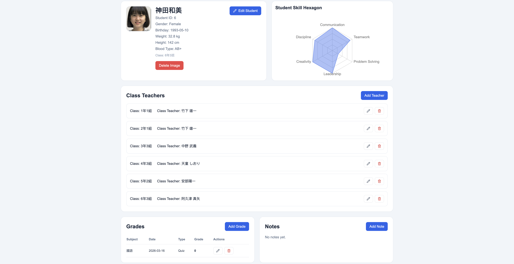

# Student Profile Management System

A **React + Vite web application** that allows teachers to manage classes and student profiles. The system supports class management, student records, grade tracking, notes, and skill visualization using a hexagon radar chart.

Data is stored using a SQLite database through a Node.js + Express backend.

The system also supports JSON backup import/export for data migration and recovery.

## Inspiration

This project was inspired by the Japanese drama **The Queen's Classroom (女王の教室)**, where a teacher uses a comprehensive student management system to track student records and classroom performance. The idea behind this application is to recreate a similar system using modern web technologies, allowing teachers to manage classes, student profiles, grades, notes, and skill assessments in a centralized platform.

---
# Demo
## Real World Live Demo

[](https://youtu.be/OLBE4jLOxog)
---

# Features

## Authentication

- Simple teacher login system
- Credentials stored in SQLite database
- Protected routes to prevent unauthorized access

## Class Management

- Create new classes
- Edit class information
- Delete classes
- View students in each class
- Export all stored data to a JSON backup file
- Import a JSON backup file on another computer and continue editing

## Student Management

- Add students to a class
- Edit student information
- Delete students
- Upload and display student profile images
- Drag-and-drop to reorder students
- Categorize students by gender
- Show male and female student sections separately
- Automatically update student sequence numbers after reordering

## Student Profile Page

Each student has a dedicated page displaying:

- Student name
- Student ID
- Gender
- Birthday
- Weight
- Height
- Blood type
- Profile image
- Skill hexagon chart
- Teacher assignments
- Grades
- Notes
- Download student report as PDF

## Teacher Assignment Management

Each student can have different teachers for different levels.

- Add teacher assignments
- Edit teacher assignments
- Delete teacher assignments

Fields include:

- Level
- Teacher name

## Grade Management

- Add grades
- Edit grades
- Delete grades

Fields include:

- Subject
- Date
- Type (Quiz / Test / Exam)
- Score

## Notes System

- Add notes
- Edit notes
- Delete notes

Used for teacher observations or feedback.

## Skill Visualization

Student performance is visualized using a **hexagon radar chart** with the following skills:

- Communication
- Teamwork
- Problem Solving
- Leadership
- Creativity
- Discipline

## PDF Export

The system allows teachers to download an individual student profile as a PDF file.

The exported PDF includes:

- Student name
- Student ID
- Gender
- Birthday
- Weight
- Height
- Blood type
- Student profile image
- Skill summary
- Teacher assignments
- Grades list
- Notes

---

# Technologies Used

- React
- Vite
- Tailwind CSS
- React Router
- Recharts (Radar Chart)
- @dnd-kit/core
- @dnd-kit/sortable
- @dnd-kit/utilities
- jsPDF
- jspdf-autotable
- Lucide React Icons
- Node.js
- Express.js
- SQLite (better-sqlite3)
- JSON Backup Import/Export

---

# Project Structure
```bash
src
│
├── components
│   ├── ClassCard.jsx
│   ├── StudentCard.jsx
│   ├── Navbar.jsx
│   ├── ProtectedRoute.jsx
│   ├── SkillRadarChart.jsx
│   ├── StudentFormModal.jsx
│   ├── GradeFormModal.jsx
│   └── NoteFormModal.jsx
│
├── pages
│   ├── LoginPage.jsx
│   ├── DashboardPage.jsx
│   ├── ClassPage.jsx
│   └── StudentDetailPage.jsx
│
├── context
│   ├── AuthContext.jsx
│   └── SchoolContext.jsx
│
├── utils
│   └── storage.js
│
├── backend
│   ├── server.js
│   ├── students.sqlite
│   └── package.json
│
├── App.jsx
├── main.jsx
└── index.css
```

# How Data is Stored

The application uses SQLite as the primary database.

Database file:

```text
backend/students.sqlite
```

## Database Tables

### users

Stores teacher login information.

### classes

Stores class information and student records.

### meta

Stores application metadata such as the current logged-in user.

---

## Backup System

### Export Data

The Export Data button generates a JSON backup file from SQLite.

Example:

```text
student_profile_backup_YYYY-MM-DD.json
```

### Import Data

The Import Data button restores a JSON backup into SQLite.

### Legacy Migration

Existing `student_profile_backup.json` files can be migrated into SQLite during setup.

# Installation

1. Clone the repository
```bash
git clone https://github.com/JarvisLam-LemonCEO/Student-Profile-System.git
```

2. Enter the project folder
```bash
cd student-profile-system
```

3. Install frontend dependencies

```bash
npm install
```

4. Install backend dependencies in the backend folder

```bash
cd backend
npm install
```

5. Run backend

```bash
node server.js
```

Backend URL:

```text
http://localhost:3001
```

6. Run frontend

```bash
npm run dev
```

7. Open browser

```text
http://localhost:5173
```

# Screenshots





# Limitations
1. Passwords are currently stored without encryption
2. SQLite database is stored locally on the machine running the backend
3. No cloud synchronization
4. Single-teacher authentication model
5. Not intended for production use without additional security improvements

This design is intended for learning and demonstration purposes.

# Future Improvements
Possible enhancements:
1. Secure authentication with hashed passwords
2. Cloud database support (PostgreSQL / MySQL)PostgreSQL)
3. Secure authentication with hashed passwords
4. Multiple teacher accounts
5. Student search and filtering
6. Export/import class data
7. Dark mode support
8. Image compression

License
This project is for educational purposes.

